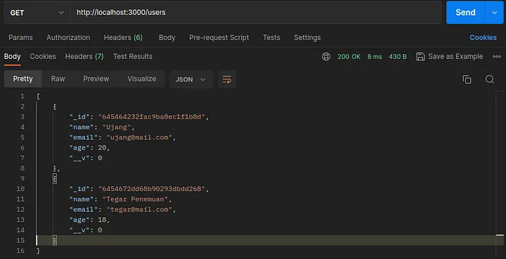
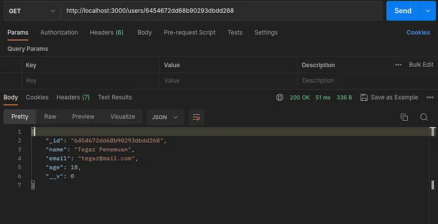
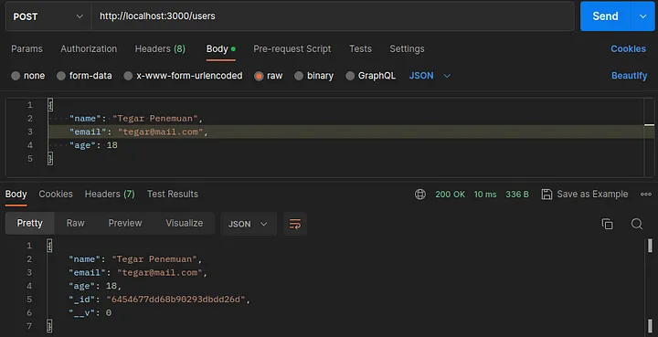
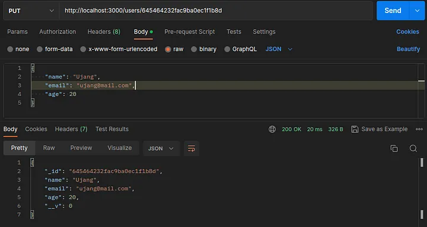
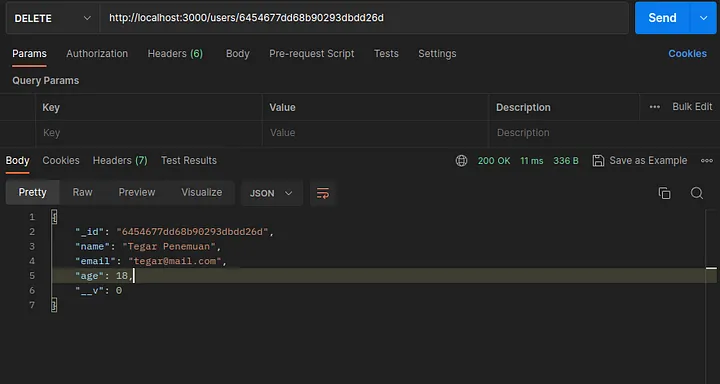

# RESTful API MongoDB Express

Tutorial lengkap:
https://medium.com/@tegarpenemuan/restful-api-mongodb-express-c1eb98987197

# Cara Install

1. Clone projek
2. npm i
3. npm run dev
4. buka http://localhost:3000/users di browser

# Akses di Postman

Silahkan lakukan pengujian, Disini kita menggunakan Postman.

1. Get all users

   

2. Get user by id

   

3. Add user

   

4. Update user

   

5. Delete user

   
